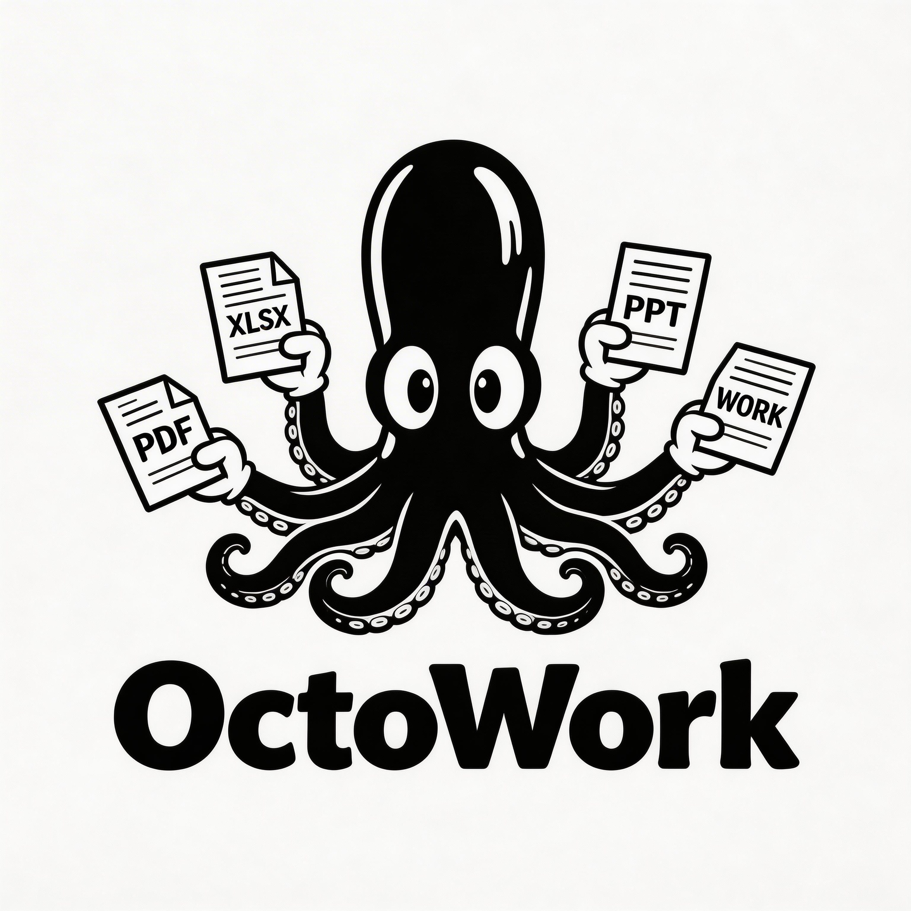

<p align="center">
  
</p>

<h1 align="center">OctoWork</h1>

<p align="center"><strong>一個人，八隻手。用 AI 把你的工作變成可重複執行的系統。</strong></p>

<p align="center">
  <a href="#安裝">安裝</a> ·
  <a href="#他們怎麼用-octowork">使用故事</a> ·
  <a href="#快速開始">快速開始</a> ·
  <a href="docs/getting-started.md">完整文件</a> ·
  <a href="https://discord.gg/V2yvQgKs3F"></a>
</p>

<p align="center">v0.2.0</p>

---

OctoWork 是一個開源框架，讓任何上班族透過 AI 建構自己的工作作業系統。

你不需要會寫程式。回答幾個問題，10 分鐘就能生成一整套個人化的工作系統。

大部分人用 AI 的方式是「每次都重新講一遍需求」。OctoWork 讓 AI 記住你的一切——你的公司、你的產品、你的做事方式——然後用可重複執行的「技能（Skill）」和「流程（Workflow）」幫你做事。

- **做過的事** → 存成 Skill → 下次 AI 自動做
- **一串事** → 串成 Workflow → 一句話啟動流水線
- **學到的經驗** → 加回系統 → AI 越用越懂你

**一個人就是一個部門。**

---

## 他們怎麼用 OctoWork

### 社群小編芷涵

芷涵一個人管四個平台，每個月要擠出五十幾則內容。她寫東西其實很快，真正卡她的是「決定要寫什麼」。

每週一早上經理 Eric 會問這週社群要發什麼，芷涵就開始頭痛——這週有什麼節日、行銷部有沒有檔期要配合、上週哪種貼文數據比較好要不要多做幾篇、IG 發過的東西 FB 要怎麼改才不會像複製貼上。光是把一週的內容排好，早上就沒了。

週五更慘。Eric 看週報不是想知道「這週發了幾篇」，他想聽的是「哪篇爆了、為什麼爆、下週能不能再來一次」。芷涵要從後台把數據一個一個拉出來、截圖、算觸及率、跟上週比，然後擠出一段聽起來有洞察的分析。每個禮拜五下午三小時就這樣燒掉了。

她開始用 OctoWork 之後，先花了一個小時把自己的東西寫進系統——品牌講話的語氣、內容比例的原則、每個產品適合做什麼類型的貼文、Eric 看報告的習慣。

然後事情就變了。週一她跟 Claude 說「排這週內容」，系統自己去查有沒有節日和檔期、參考她的內容比例原則、看上週哪類貼文互動高，三分鐘丟出一張排程表。芷涵掃一眼、改兩個、確認，十分鐘搞定。

週五她說「寫週報」，把後台數字貼進去，系統自動跟上週比、挑出表現最好和最差的各一篇、分析可能原因、建議下週調整方向。整份報告十分鐘出來，而且語氣剛好是 Eric 喜歡的那種——先講結論、再給數據、最後附建議。

用了三個月，她的系統裡長出八個 Skill 和三個 Workflow。有一天 Eric 說「你最近產出速度好像變很快」，芷涵回他：「不是我變快，是我把我的方法教給 AI 了，現在它會照我的方式做。」

### 行銷企劃 Kevin

Kevin 負責公司一整年的行銷檔期，母親節、週年慶、聖誕節、年終大促，前前後後十幾檔。每一檔都是一樣的循環——寫企劃、抓預算、找 KOL、跟設計和社群對接、盯執行、最後出檢討報告。

他的問題不是不會寫企劃，而是每次都從一份空白文件開始。三個月前母親節的企劃他寫得很順，架構清楚、預算也算得漂亮。但現在要做中秋節，他打開新文件，看著空白的畫面發呆，想不起來當初的架構是怎麼拉的。只好翻回母親節那份來抄，改一改數字、換一換品項，搞了大半天。

更折磨人的是檔期結束後的成效報告。老闆想看的不是流水帳，而是「花了多少錢、賺了多少回來、哪個管道效果最好、下次要不要繼續」。Kevin 要從五個地方撈數據——廣告後台、GA4、門市 POS、KOL 的結案報告、社群的互動數據——拼成一份完整的檢討。每次做完一檔，光是出報告就要一整天。

他裝 OctoWork 之後，把企劃書的架構變成一個 Skill——只要輸入檔期名稱、時間、主推品、預算上限，十五分鐘出一份完整企劃，架構跟他自己寫的一模一樣，因為就是從他寫過最好的那份提煉出來的。

成效報告也是。他定義好「我每次檢討都看哪些指標、怎麼比較、結論要用什麼格式」，存成 Skill。現在檔期一結束，他把各平台數據貼進去，系統自動算 ROI、比對目標、標出超標和沒達的項目，連「下次建議」都會根據他過去累積的檔期經驗自動生成。

半年後 Kevin 發現一件意想不到的事：他的系統變成了一本活的「行銷檔期教科書」。每做完一檔他就加一條心得到做事原則裡，系統越來越厚。有一次他在寫雙十一企劃，AI 主動提醒他：「你去年雙十一的檢討裡有寫，備貨量要抓平常的三倍，不是兩倍，因為去年最後兩天斷貨了。」

他當下愣了一秒，因為他自己已經忘了這件事。

### 業務助理佩君

佩君支援三個業務，每天做的事說起來很簡單——報價、跟單、整理客戶資料、做報表、安排會議。但「簡單」不代表「快」。

報價最花時間。每個客戶的品項組合不同、折扣不同、付款條件不同。佩君每次做報價都要翻上一次的報價單看給過什麼價、確認最新的價格表有沒有異動、查這個客戶的折扣是幾趴、套進公司的報價模板。一份報價單至少四十分鐘，有時候一天要做三到五份。

月底更是煉獄。三個業務的訂單資料散在不同的 Excel 裡，佩君要把它們合在一起、按客戶統計、算每個人的達成率、跟上個月比較、標出哪些老客戶這個月沒回購。做完已經天黑了，還沒開始寫分析。

她開始用 OctoWork 之後，先把最痛的那件事——報價——變成 Skill。她把公司的報價模板、折扣規則、付款條件全部寫進 company.md，然後把每個主要客戶的歷史報價記在 products.md 裡。

現在業務 James 走過來說「幫我報個價給台中的李大哥，品項跟上次一樣、數量加倍」，佩君跟 Claude 說同一句話，五分鐘後一份完整報價單就出來了——品項、單價、數量、折扣、付款條件全部自動帶入，她只要確認一眼就能寄出去。

月底她說「出這個月的業績報表」，把訂單資料貼進去，十五分鐘後三個業務的個別報表和一份總表全部做好。達成率、客戶排名、跟上月比較、掉單警示，全部算完。

有一天業務 Cathy 問她：「你是不是最近偷請了一個工讀生幫你？以前報價要等半天，現在十分鐘就收到了。」佩君笑了笑，沒有回答。

---

## OctoWork 的八大核心

**一、角色定義**
你是誰。你的職稱、你負責的事、你的 KPI、你的團隊、你用什麼工具。這是整個系統的地基——AI 要幫你做事，它得先知道你是誰。

**二、技能（Skill）**
你會做什麼。每一件你重複在做的事，都可以變成一個 Skill：輸入什麼、產出什麼、品質標準是什麼。教一次，AI 就會照你的方式做，而且每次都一樣好。

**三、流程（Workflow）**
事情怎麼串。做完 A 就要做 B 再做 C——這種固定順序的工作串成一個 Workflow，一句話啟動，AI 按步驟帶你走完。

**四、累積**
每次做完事，AI 問你「學到什麼」，你的回答會自動加進系統。踩過的坑、有效的做法、主管的偏好、客戶的眉角——這些過去只存在你腦子裡會忘掉的東西，現在全部變成做事原則，AI 每次做事都會參考。做越多，系統越厚，產出越準。

**五、引導**
大部分人不是不會做事，是不知道怎麼把「我會做事」變成「一套系統」。OctoWork 的訪談生成器會一步步引導你，把你腦袋裡的東西拉出來，變成結構化的檔案。你只需要回答問題，系統自己長出來。

**六、進步**
系統不是建完就不動了。復盤機制讓 AI 定期讀完你所有的檔案，主動找出缺口——做事原則哪裡太薄、哪個工作還沒有 Skill、哪些 Skill 可以串成 Workflow——然後一個一個問你，幫你把系統補強。用越久，系統越完整。

**七、外部資源**
一個人的經驗有限，一群人的經驗是指數級的。社群裡每個人都在打磨自己的 Skill 和 Workflow，這些實戰驗證過的做法可以共享給所有人。你貢獻你擅長的，別人貢獻他擅長的，大家一起變強。

**八、成長**
不只是做好現在的事，而是幫你變成更強的人。AI 分析你目前的系統狀態——你會什麼、你缺什麼、你的下一步應該是什麼——然後建議你該長什麼新能力，自動生成對應的 Skill 和 Workflow。你的系統就是你的成長地圖。

---

<p align="center">
  
</p>

## 不只是人用的工具

OctoWork 的核心是一堆 Markdown 檔案——角色定義、技能、流程、做事原則。這些檔案不只是人可以讀，AI Agent 也可以讀。

這代表 OctoWork 可以作為任何 AI Agent 框架的**技能中心**：

```
AI Agent 框架（觸發層）
決定什麼時候做什麼、排程、監控
例如：OpenClaw、n8n、LangChain、AutoGen、自己寫的 cron job
        ↓
OctoWork（技能層）
定義怎麼做、做到什麼標準、用什麼判斷邏輯
角色定義 + Skills + Workflows + 做事原則
        ↓
MCP / API（執行層）
實際連接外部系統
發 email、更新試算表、登入 ERP、呼叫第三方 API
```

AI Agent 框架解決的是「什麼時候做」和「怎麼執行」。但它們缺一個關鍵的中間層——**這個職位的人到底是怎麼做事的**。什麼情況該怎麼判斷、報告要用什麼格式、主管喜歡先看結論還是先看數據、庫存低於多少要補貨——這些東西不是寫程式能解決的，是靠經驗累積的。

OctoWork 就是補這一層。

今天你用 OctoWork 搭配 Claude Code，是人在操作、AI 在輔助。哪天你接上一個 AI Agent 框架，同一套 Skills 和 Workflows 不用改，Agent 直接就知道怎麼做這個職位的所有事。

**你現在花時間建的系統，不只是現在有用——它是未來 AI Agent 的操作手冊。**

---

## 30 秒看懂

```
workspace/
├── CLAUDE.md          ← 你是誰 + 你怎麼做事
├── company.md         ← 你的公司、品牌、客群
├── products.md        ← 你的產品/服務（可選）
├── .agents/skills/    ← 技能模組
├── workflows/         ← 工作流程
└── outputs/           ← 所有產出
```

你只維護前面 3 個檔案。Skills 和 Workflows 在工作中自然長出來。

---

## 安裝

### 1. 安裝 Node.js（如果還沒有的話）

到 [nodejs.org](https://nodejs.org/) 下載 **LTS 版本**，安裝時一直按下一步就好。

裝完後打開終端機，確認一下：

```bash
node -v
```

看到版本號（例如 `v22.x.x`）就代表成功。

> **什麼是終端機？** Mac 按 `Cmd + 空白鍵` 搜尋「Terminal」；Windows 按 `Win` 搜尋「PowerShell」。就是一個可以打字下指令的視窗。

### 2. 安裝 AI 工具（選一個就好）

#### 選項 A：Claude Code（推薦）

```bash
npm install -g @anthropic-ai/claude-code
```

安裝完輸入 `claude`，會引導你登入。需要 [Anthropic 帳號](https://console.anthropic.com/)。

#### 選項 B：Gemini CLI

```bash
npm install -g @google/gemini-cli
```

安裝完輸入 `gemini`，會引導你登入 Google 帳號。

> **安裝卡住了？** `command not found` → Node.js 沒裝好，重裝一次。Mac 出現 `permission denied` → 指令前面加 `sudo`。

### 3. 下載 OctoWork

```bash
git clone https://github.com/mocoolee/octowork.git
cd octowork
```

沒有裝 git？直接到 [GitHub 頁面](https://github.com/mocoolee/octowork) 點「Code → Download ZIP」，解壓縮後 `cd` 進去就好。

---

## 快速開始

### 方法一：AI 幫你建（推薦，約 10 分鐘）

```bash
claude
```

> 用 Gemini CLI 的話，先 `cp CLAUDE.md GEMINI.md`，再輸入 `gemini`。

AI 啟動後，跟它說：

```
幫我建一套 OctoWork
```

AI 會像聊天一樣，**一次問你一個問題**，問完四輪：

| 輪次 | 聊什麼 | 大概會問 |
|------|--------|---------|
| 第 1 輪 | 你是誰 | 公司、職稱、KPI、團隊、工具 |
| 第 2 輪 | 你怎麼做事 | 判斷依據、協作者風格、踩過的坑 |
| 第 3 輪 | 重複的工作 | 每天/每週/每月固定在做的事 |
| 第 4 輪 | 一條龍流程 | 做完 A 就要接著做 B 再做 C 的工作 |

每一輪結束，AI 會摘要確認，確認後**立刻存檔**——所以就算你中途關掉，下次打開會從斷點繼續，不用重來。

四輪聊完後，AI 會問你「還有沒有想補充的？」沒有的話就開始建系統。

AI 會列出建議的 Skill 清單，**你選要建哪幾個就好**——不用全部建，剩下的以後隨時可以加。

最後生成的檔案：

- **CLAUDE.md** — 你的角色設定和做事原則
- **company.md** — 公司背景資料
- **products.md** — 產品/服務資料（如果需要）
- **你選的 Skills** — 你最常做的重複工作
- **你選的 Workflows** — 一句話觸發的工作流水線

所有檔案都在 `workspace/` 裡，直接打開就看得到。

### 方法二：從範例開始改（5 分鐘）

不想被訪談？直接複製一份範例來改：

```bash
cp -r examples/store-ops/. workspace/
```

| 範例 | 適合誰 | 內含 |
|------|--------|------|
| `store-ops` | 門市營運 | 9 Skills + 4 Workflows |
| `marketing` | 電商行銷 | 7 Skills + 3 Workflows |

複製後把 `CLAUDE.md`、`company.md`、`products.md` 裡的內容換成你自己的就好。

---

## 開始使用

系統建好之後，每次要工作就打開終端機：

```bash
cd octowork
claude
```

然後跟 AI 說：

```
開工
```

AI 會讀取你的系統，切換到工作模式。從這一刻起，它知道你是誰、你的公司在做什麼、你的主管喜歡什麼格式的報告。

### 用 Skill 做事

直接用自然語言說你要做什麼：

```
幫我寫今天的日報
```

AI 會自動找到對應的 Skill，按照你定義的格式和規範產出。

### 跑 Workflow 流水線

```
啟動每日晨會流程
```

AI 會按步驟跑：看數據 → 找異常 → 產日報 → 生成 LINE 精簡版。每一步會暫停讓你確認，確認後才往下走。

### 讓系統越來越聰明

每次做完事，AI 會問你：

```
有沒有什麼值得記下來的經驗？
```

你說的東西會被加到 CLAUDE.md 的「做事原則」裡。下次遇到類似狀況，AI 就會參考這些經驗。用越久，系統越像你。

### 新增 Skill

碰到新的重複工作，跟 AI 說：

```
把剛才的做法存成一個 Skill
```

AI 會自動生成新的 Skill，下次同樣的事不用重新講。

### 復盤

用了一陣子，想讓系統更完整？跟 AI 說：

```
復盤
```

AI 會讀完你所有的檔案，從七大面向（角色與KPI、協作者、做事原則、技能、流程、公司與產品、目前進行中）找出最需要補強的，一次問你一個問題。每完成一個面向會問你要不要繼續，說「夠了」就結束，AI 會摘要這次復盤更新了什麼。

系統會記錄你的上次復盤日期。**超過 30 天沒復盤，下次開工時 AI 會自動提醒你**——你可以選擇做或跳過，不會強迫。

> 建議用了一兩週後做第一次復盤，效果最好——因為你已經知道哪些 Skill 好用、哪些還不夠。

---

<p align="center">
  
</p>

## 怎麼把 OctoWork 用在你的工作上

### 第一週：先讓 AI 幫你做事

不用想太多，每天上班打開 Claude，說「開工」，然後正常工作。

碰到要做的事，直接用嘴巴講就好：

```
幫我寫今天的日報
處理這個客訴，客人說買回去的東西有異味
幫我做一份報價給台中的李大哥
```

如果這件事你的系統裡有對應的 Skill，AI 會自動按照你定義的格式產出——跟上次一模一樣。

如果系統裡沒有，AI 還是會幫你做，只是格式不是你的、品質可能參差。沒關係，這很正常。

做完一件事，AI 會問你：「有沒有什麼值得記下來的？」有就講，沒有就說沒有，不用每次都硬擠。

**這週的重點：先用起來就好，不要急著完善系統。**

### 第二週開始：讓系統跟著你長

用了一週，你會開始發現哪些事情是重複的。這時候開始讓系統跟著你長：

**碰到一件事做了第二次：**
```
把剛才做競品分析的方法存成一個 Skill
```
AI 會自動生成 Skill，下次做同樣的事就有你的格式了。

**發現某個 Skill 產出的東西不太對：**
```
週報的格式改一下，結論不要超過三句話
```
AI 會幫你改 Skill，改完確認就生效。

**發現幾件事總是連著做：**
```
每次做檔期都要先看庫存、再寫文案、再出佈達，幫我串成一個 Workflow
```
下次說「啟動 XX 檔期」就自動跑完整個流程。

**某個同事的溝通眉角你搞清楚了：**
```
記一下，Andy 看報告喜歡表格，不喜歡一大段文字
```
AI 把這個加到你的協作者資訊裡，以後做給 Andy 的東西會自動用表格。

**這階段的重點：順手就好，工作中想到什麼就說什麼。不用特地排時間「維護系統」。**

### 每個月：花 15 分鐘復盤一次

一個月到了，跟 AI 說：

```
復盤
```

AI 會讀完你所有的檔案，主動找出可以補強的地方，一個一個問你。通常會問：

- 「你的做事原則裡『報告』類只有 2 條，要不要補更多？」
- 「協作者 Tina 只有名字，她的溝通風格是什麼？」
- 「你常做月結報表但沒有 Skill，要不要建一個？」

你回答，AI 直接更新檔案。說「夠了」就結束。

復盤完，再說一句：

```
整理原則
```

AI 幫你清理過時的、重複的做事原則，保持系統精簡。

> 如果你忘了復盤也沒關係——超過 30 天沒復盤，下次開工時 AI 會自動提醒你。

### 你不用刻意「維護」

OctoWork 的設計就是在工作中自然成長，不需要特別排時間維護：

- 做完事分享經驗 → 做事原則自動變厚
- 碰到新的重複工作 → 存成 Skill，系統能力自動變多
- 發現連續動作 → 串成 Workflow，效率自動變高

**唯一要刻意做的就是每月 15 分鐘的復盤，其他全部是順手的。**

三個月後回頭看，你會發現系統已經累積了幾十條做事原則、十幾個 Skill、好幾個 Workflow。它比你自己記得還多——因為你每次做完事分享的經驗，它全部記住了。

---

## 復盤怎麼運作

每個月跟 AI 說「復盤」，AI 會讀完你所有的檔案，然後從七大面向逐一檢查你的系統，找出可以補強的地方。

### 第一步：AI 判斷優先順序

AI 讀完檔案後，會自動判斷哪些面向最需要補強。例如：
- 你的協作者只有名字沒有溝通風格 → 優先問協作者面
- 某個工作類型的做事原則只有 1 條 → 優先問做事原則面
- 「目前進行中」裡面有三個月前的事 → 優先清理

### 第二步：一次問你一個問題

AI 不會把所有問題一次丟出來。它會從最需要的面向開始，一題一題問：

> 「你的協作者裡有寫 Andy，但只有名字和負責範圍。他看報告喜歡什麼格式？有沒有什麼溝通上的眉角？」

你回答後，AI 直接更新對應的檔案。

### 第三步：每完成一個面向，問你要不要繼續

> 「協作者的部分更新完了。接下來看看做事原則？還是你覺得夠了？」

你可以繼續，也可以說「夠了」。

### 第四步：摘要

結束後 AI 會列出這次復盤更新了什麼：

> 「這次復盤更新了：
> - 補了 3 個協作者的溝通風格
> - 新增 2 條做事原則
> - 移除 2 個已完成的進行中項目
> - 新增 1 個 Skill（月結報表）」

### 七大面向的完整問題

<details>
<summary>點開看 AI 會從哪些角度追問</summary>

**一、角色與 KPI**
- 你的職責有沒有變？多負責或少負責什麼？
- KPI 數字有沒有調整？目標有沒有變？
- 有沒有新加入或離開的團隊成員？
- 直屬主管有沒有換？新主管風格是什麼？

**二、協作者**
- 每個人的溝通風格夠不夠具體？（格式偏好、最佳聯絡時機、地雷）
- 有沒有新的常合作的人要加？
- 有沒有哪個人的資訊過時了？（換部門、離職）
- 合作過程中有沒有學到什麼溝通技巧？

**三、做事原則**
- 哪些工作類型的原則太少（不到 3 條）？
- 最近有沒有踩坑還沒記下來？
- 有沒有哪條原則後來發現是錯的？
- 有沒有做得特別好但沒寫下為什麼好？
- 有沒有「別人常犯但你知道要避開」的事？

**四、技能（Skill）**
- 最近在做什麼重複的工作還沒變成 Skill？
- 現有 Skill 產出品質好嗎？有沒有每次都要改的？
- 有沒有 Skill 缺精簡版產出（直接貼 LINE/email 的）？
- 哪個 Skill 最常用？哪個幾乎沒用過？

**五、流程（Workflow）**
- 有沒有幾個 Skill 每次都連著用？應該串成 Workflow
- 現有 Workflow 有沒有缺步驟或多餘步驟？
- 有沒有每週/每月固定流程還沒建？

**六、公司與產品**
- company.md 有沒有過時資訊？（組織調整、品牌變化）
- products.md 有沒有新產品要加、舊的要更新？
- 最近公司有沒有重大決策影響工作方式？

**七、目前進行中**
- 哪些事已經完成了？可以移掉
- 有沒有新的專案或任務要加？
- 有沒有哪個項目的優先順序變了？
- 有沒有卡住的事需要調整做法？

</details>

---

## 搭配 Obsidian 使用

OctoWork 的所有東西都是 Markdown 檔案，用 [Obsidian](https://obsidian.md/) 打開 `workspace/` 資料夾，直接就是一個完整的知識庫。

**不用改任何東西就能做到的：**
- 所有檔案（CLAUDE.md、company.md、Skills、Workflows）自動變成互相連結的筆記
- 用 Obsidian 的 Graph View 看你的系統全貌——哪些 Skill 跟哪些原則有關、哪些 Workflow 串了哪些 Skill
- 做事原則用 tag 分類，比在一個大清單裡翻好找
- outputs/ 裡每次的產出都可以搜尋和回顧

**使用方式：**
- Obsidian 負責「看」— 瀏覽、搜尋、整理你的系統
- Claude Code 負責「做」— 執行 Skill、跑 Workflow、生成內容

兩個工具各司其職，不衝突。

---

## 系統的生命週期

OctoWork 不是一次設定好就不動的。它是一個會跟著你成長的系統：

```
建系統（10 分鐘）
  ↓
開始工作，用 Skill 做事
  ↓
做完事 → AI 問你「學到什麼？」→ 累積做事原則
  ↓
碰到新的重複工作 → 「存成 Skill」→ 系統長出新能力
  ↓
發現幾個 Skill 常一起用 → 「存成 Workflow」→ 串成流水線
  ↓
每月復盤 → AI 主動找出系統的缺口，幫你補強
  ↓
每月整理 → 歸檔過時的原則，保持系統精簡
```

| 你說什麼 | AI 做什麼 |
|---------|----------|
| 「開工」 | 讀取你的系統，進入工作模式 |
| 「目錄」 | 顯示互動式選單：個人/公司/產品總結、技能清單、流程清單、快速指令 |
| 「幫我寫週報」 | 用你的 Skill 產出，格式和品質一致 |
| 「啟動母親節檔期」 | 按 Workflow 一步一步帶你走 |
| 「存成 Skill」 | 把剛才的做法變成可重複的 Skill |
| 「存成 Workflow」 | 把幾個 Skill 串成流水線 |
| 「復盤」 | 讀完所有檔案，找出可以補強的地方，一個一個問你 |
| 「整理原則」 | 合併重複的、歸檔過時的做事原則 |
| 「幫我更新」 | 更新 OctoWork 框架，問你要不要裝新功能 |

詳見 [系統維護指南](docs/maintaining-your-system.md)。

---

## 專案結構

```
octowork/
├── CLAUDE.md                  ← 入口指令（AI 讀這個知道怎麼幫你）
├── VERSION                    ← 版本號
├── CHANGELOG.md               ← 更新紀錄
│
├── core/                      ← 框架核心（升級時更新）
│   ├── generator/                系統生成器
│   └── templates/                模板
│
├── examples/                  ← 範例庫（升級時更新）
│   ├── store-ops/                門市營運
│   └── marketing/                電商行銷
│
├── docs/                      ← 文件（升級時更新）
│
└── workspace/                 ← 你的資料（永遠不會被動到）
    ├── CLAUDE.md
    ├── company.md
    └── ...
```

`core/`、`examples/`、`docs/` 是框架的，`git pull` 會更新。

`workspace/` 是你的，被 `.gitignore` 保護，永遠不動。

---

## 升級

```bash
# 在 AI 裡面說
幫我更新
```

或手動：

```bash
git pull origin main
```

AI 會告訴你更新了什麼，問你要不要把新功能裝到你的系統裡。你的 `workspace/` 不會被動到。

詳見 [升級指南](docs/upgrading.md)。

---

## 相容性

| 工具 | 狀態 | 說明 |
|------|------|------|
| [Claude Code](https://docs.anthropic.com/en/docs/claude-code) | ✅ | 原生支援 CLAUDE.md + .agents/skills/ |
| [Gemini CLI](https://github.com/google-gemini/gemini-cli) | ✅ | 改名 GEMINI.md，格式通用 |
| 其他 AI CLI | 🟡 | 核心是 Markdown，可自行適配 |

---

## 常見問題

### 基本問題

<details>
<summary><strong>我需要會寫程式嗎？</strong></summary>

完全不用。OctoWork 的所有操作都是用自然語言跟 AI 對話。你不需要懂任何程式語言、命令列語法、或 Markdown 格式——AI 會幫你處理所有技術細節。你只需要會打字、會回答問題。

唯一需要用到命令列的地方是安裝（三行指令，照貼就好）和每次啟動（`cd octowork` → `claude`）。
</details>

<details>
<summary><strong>建一套系統要多久？</strong></summary>

大約 10-15 分鐘。AI 會用聊天的方式，**一次問你一個問題**，分四輪聊：

1. **你是誰** — 公司、職稱、KPI、團隊、工具
2. **你怎麼做事** — 判斷依據、主管偏好、踩過的坑
3. **你的重複工作** — 每天/每週/每月固定做的事
4. **你的流程** — 做完 A 就要做 B 再做 C 的串接工作

像跟同事聊天一樣，不用提前準備。每一輪結束 AI 會摘要確認，確認後**立刻存檔**——中途關掉不會消失，下次打開從斷點繼續。

四輪聊完後 AI 還會問你「有沒有想補充的？」然後列出建議的 Skill 清單讓你選要建哪幾個（不用全建）。最後生成完整系統。
</details>

<details>
<summary><strong>我的資料安全嗎？</strong></summary>

分兩個層面：

**本地檔案：安全。** 你的系統檔案存在你自己電腦的 `workspace/` 資料夾裡，被 `.gitignore` 保護，不會透過 git 上傳到任何地方。框架升級（`git pull`）也不會動到你的 `workspace/`。

**AI 處理：會經過雲端。** 當你使用 Claude Code 或 Gemini CLI 時，你跟 AI 對話的內容（包含你的 CLAUDE.md、company.md 等檔案）會被傳送到 AI 服務的伺服器進行處理。這跟你用 ChatGPT 是一樣的道理。

所以建議不要把密碼、身分證字號、公司機密文件等敏感資料寫進系統裡。詳見 [資料安全說明](docs/security.md)。
</details>

<details>
<summary><strong>跟直接用 ChatGPT / Claude 有什麼不同？</strong></summary>

最大的差別是**記憶**和**一致性**。

用 ChatGPT，你每次都要重新講：「我在 XX 公司、負責 XX、主管喜歡 XX 格式...」。OctoWork 把這些全部寫在檔案裡，AI 每次開機自動讀取，不用重複講。

用 ChatGPT，你每次產出的格式、品質、風格都不一樣。OctoWork 的 Skill 定義了「這件事怎麼做、產出長什麼樣、品質標準是什麼」，所以每次產出都是一致的。

用 ChatGPT，你學到的經驗下次就忘了。OctoWork 的做事原則會持續累積，AI 會越來越懂你的工作方式。

簡單說：ChatGPT 是一個聰明但失憶的助手，OctoWork 讓它變成一個記得你所有事的專屬助理。
</details>

---

### 日常使用

<details>
<summary><strong>碰到系統裡沒有的新工作怎麼辦？</strong></summary>

直接跟 AI 說你要做什麼就好，不需要先建 Skill。

例如你的系統裡沒有「競品分析」這個 Skill，但主管突然叫你做。你直接說「幫我分析一下 XX 競品」，AI 還是會幫你做——只是沒有你的個人化格式，產出可能需要你多改一些。

做完之後，如果你覺得「這件事以後還會做」，跟 AI 說：

```
把剛才做競品分析的方法存成一個 Skill
```

AI 會根據剛才的做法自動生成一個 SKILL.md，包含輸入格式、產出模板、品質規範。下次再做同樣的事，品質就會一致。

**系統不是一開始就要完美的。** 先用生成器建一個起點，然後在工作中慢慢長出新的 Skill。
</details>

<details>
<summary><strong>怎麼更新已經有的 Skill？</strong></summary>

有兩條路：

**改 Skill 本身（改「怎麼做」）：** 直接跟 AI 說你要改什麼。例如：

```
週報的格式改一下，加一欄「本週新客數」
```

AI 會去讀你的 SKILL.md，幫你改產出模板，改完讓你確認。

**加做事原則（改「做的時候注意什麼」）：** 每次做完事，AI 會問「有沒有值得記下來的經驗？」你說的東西會被加到 CLAUDE.md 的做事原則裡。例如：

```
以後週報結論不要超過三句話，David 說太長他不看。
```

下次跑週報 Skill 時，AI 就會參考這條原則。

| 方式 | 什麼時候用 | 改的是什麼 |
|------|-----------|-----------|
| 「改 XX Skill」 | 格式要調、欄位要加減 | SKILL.md 本身 |
| 做完事分享經驗 | 學到新的判斷原則 | CLAUDE.md 做事原則 |
</details>

<details>
<summary><strong>Skill 存在哪裡？會不會跑到全域去？</strong></summary>

Skill 存在你自己的系統資料夾裡，不會存到全域路徑。

```
workspace/
├── .agents/
│   └── skills/
│       ├── weekly-report/    ← 生成器建的
│       ├── daily-report/     ← 生成器建的
│       └── competitor-brief/ ← 你後來加的
└── ...
```

每個人的 Skill 只屬於他自己的 `workspace/`，不會影響別人，也不會跑到 Claude Code 的全域路徑（`~/.claude/`）。系統規則裡有明確指示 AI 只能存到 `workspace/.agents/skills/`。
</details>

<details>
<summary><strong>做事原則越來越多怎麼辦？</strong></summary>

做事原則越多越好——它就是你的工作百科全書。重點不是砍數量，是保持結構清楚。

每個月花 5 分鐘跟 AI 說：

```
整理原則
```

AI 會幫你：
1. 找出重複或意思相近的原則，建議合併
2. 標出可能過時的（已結束的檔期、已離職的同事相關）
3. 把分類混亂的重新歸類

過時的原則不會被刪掉，會移到 `archives/principles-history.md`，以後想找還找得到。

| 指標 | 健康 | 需要整理 |
|------|------|---------|
| 分類 | 每個工作類型有自己的分類 | 全部混在一起 |
| 重複 | 每條原則都是獨立的 | 好幾條在講同一件事 |
| 時效 | 反映目前的做法 | 還有過時的舊原則 |
| 矛盾 | 原則之間不衝突 | A 說要、B 說不要 |

詳見 [系統維護指南](docs/maintaining-your-system.md)。
</details>

<details>
<summary><strong>Workflow 是全自動的嗎？</strong></summary>

不是。Workflow 是「AI 按步驟引導你完成工作」，不是全自動在背景跑。

每一步 AI 會幫你「想」和「寫」，然後暫停讓你確認，你說 OK 才往下走。它不會自動登入系統、不會自動發 email、不會自動發 LINE——它幫你把內容寫好，你自己貼上去發。

把它想像成一個超級聰明的 checklist 助手：它知道下一步該做什麼、幫你準備好所有東西，但關鍵的「確認」和「發送」還是你來。

這是刻意的設計。AI 會犯錯，特別是涉及對外溝通、金額判斷、人員安排的時候，你的確認就是品質把關。
</details>

<details>
<summary><strong>怎麼把幾個 Skill 串成一個流程？</strong></summary>

當你發現自己經常「做完 A 就要做 B 再做 C」，跟 AI 說：

```
以後每次做檔期，都要先做競品分析、再寫企劃、再出文案，幫我存成一個 Workflow
```

AI 會在 `workflows/` 裡生成一個 .md 檔，定義每一步要做什麼、用哪個 Skill、哪裡要停下來讓你確認。

下次你只要說「啟動 XX 檔期」，AI 就會按照這個流程一步一步帶你走完。

詳見 [Workflow 撰寫指南](docs/writing-workflows.md)。
</details>

<details>
<summary><strong>怎麼讓系統變得更完整？</strong></summary>

跟 AI 說「復盤」。

AI 會讀完你系統裡的所有檔案，從七大面向找出最需要補強的，一次問你一個問題：

| 面向 | 會問什麼 |
|------|---------|
| 角色與 KPI | 職責有沒有變？目標有沒有調整？團隊有沒有異動？ |
| 協作者 | 溝通風格夠不夠具體？有沒有新的人要加？有沒有過時的？ |
| 做事原則 | 哪些類型太少？最近踩的坑記了嗎？有沒有錯的原則？ |
| 技能 | 有沒有重複工作還沒存成 Skill？現有的品質夠好嗎？ |
| 流程 | 有沒有常連著用的 Skill 該串成 Workflow？ |
| 公司與產品 | 資訊有沒有過時？新產品要加嗎？ |
| 目前進行中 | 哪些事做完了？有沒有新任務？優先順序變了嗎？ |

AI 會判斷哪個面向最需要補強，從那裡開始問。每完成一個面向會問你：「要繼續看下一個嗎？還是夠了？」說「夠了」就結束，AI 會摘要這次復盤更新了什麼。

建議用了一兩週後做第一次復盤，效果最好——因為你已經知道哪些 Skill 好用、哪些還不夠。
</details>

---

### 安裝與設定

<details>
<summary><strong>升級會不會覆蓋我的東西？</strong></summary>

不會。OctoWork 把「框架」和「你的資料」完全分開。

升級（`git pull`）只會更新框架部分（`core/`、`examples/`、`docs/`）。你的 `workspace/` 資料夾被 `.gitignore` 保護，永遠不會被動到。

你也可以在 AI 裡面說「幫我更新」，AI 會告訴你更新了什麼、有沒有新功能可以裝到你的系統裡。整個過程會問你要不要，不會自動改你的東西。

詳見 [升級指南](docs/upgrading.md)。
</details>

<details>
<summary><strong>可以給團隊用嗎？</strong></summary>

可以。有三種模式：

**各自獨立：** 每個人 clone 一份 OctoWork，在自己的 `workspace/` 裡建自己的系統。最簡單，適合小團隊。

**共享公司層：** 主管先建好 company.md 和 products.md，發給團隊成員。每個人用生成器建自己的 CLAUDE.md（個人角色和原則）。適合需要統一公司資料的團隊。

**角色包制度：** 為每個職位建一個「角色包」（含 Skills + Workflows）。新人入職時複製角色包、填個人資料就能上手。適合有標準化崗位的公司。

詳見 [團隊部署指南](docs/team-deployment.md)。
</details>

<details>
<summary><strong>我想自己手動寫 Skill 可以嗎？</strong></summary>

可以。在你的系統裡的 `.agents/skills/` 新增一個資料夾，放一個 `SKILL.md` 就好：

```
.agents/skills/
└── my-new-skill/
    └── SKILL.md
```

SKILL.md 的基本結構：

```markdown
---
name: my-new-skill
description: "做什麼。觸發詞：xxx、yyy、zzz。"
maturity: draft
---

# Skill 名稱

## 執行前
（要先讀哪些背景檔）

## 輸入
（使用者會提供什麼）

## 產出格式
（完整的輸出模板）

## 品質檢查
（判斷標準、注意事項）
```

但其實你不需要手動寫。做完一件事後跟 AI 說「存成 Skill」，它會自動幫你生成，通常比自己寫還好。

詳見 [Skill 撰寫指南](docs/writing-skills.md)。
</details>

<details>
<summary><strong>支援 Claude Code 和 Gemini CLI 以外的工具嗎？</strong></summary>

OctoWork 的核心就是一堆 Markdown 檔案，所以理論上任何能讀取 Markdown 的 AI CLI 工具都能跑。

目前正式支援的是 Claude Code 和 Gemini CLI，因為它們都支援 `.agents/skills/` 的自動掃描。如果你用其他工具，可能需要手動告訴 AI 去讀哪些檔案。
</details>

---

## 文件

| 文件 | 內容 |
|------|------|
| [快速開始](docs/getting-started.md) | 安裝到第一次使用的完整流程 |
| [運作原理](docs/how-it-works.md) | 三層結構、越做越聰明的機制 |
| [寫 Skill](docs/writing-skills.md) | 怎麼寫出好用的 Skill |
| [寫 Workflow](docs/writing-workflows.md) | 怎麼把 Skill 串成流程 |
| [團隊部署](docs/team-deployment.md) | 團隊怎麼一起用 |
| [升級指南](docs/upgrading.md) | 怎麼安全升級 |
| [資料安全](docs/security.md) | 你的資料怎麼被處理 |
| [系統維護](docs/maintaining-your-system.md) | 怎麼整理做事原則和 Skills |

---

## 靈感來源

OctoWork 融合了 GTD、PARA、Second Brain、Agentic AI Workflows 的精華，但重新設計為「AI 幫你執行」而非「你自己執行」。

---

## 貢獻

歡迎提交新的角色範例！詳見 [CONTRIBUTING.md](CONTRIBUTING.md)。

## License

MIT
